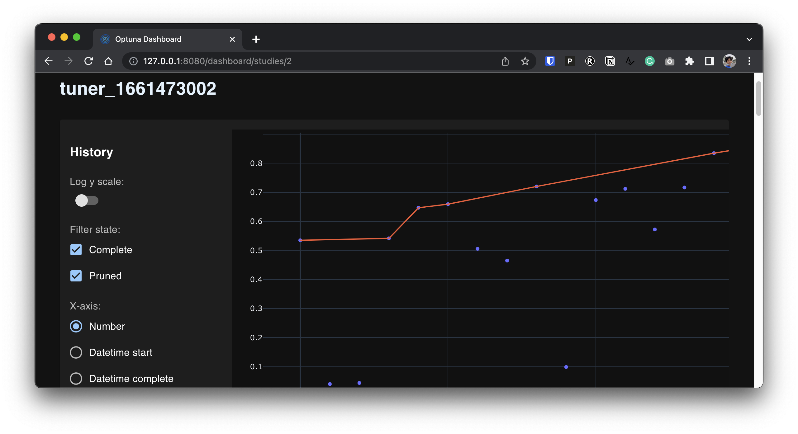
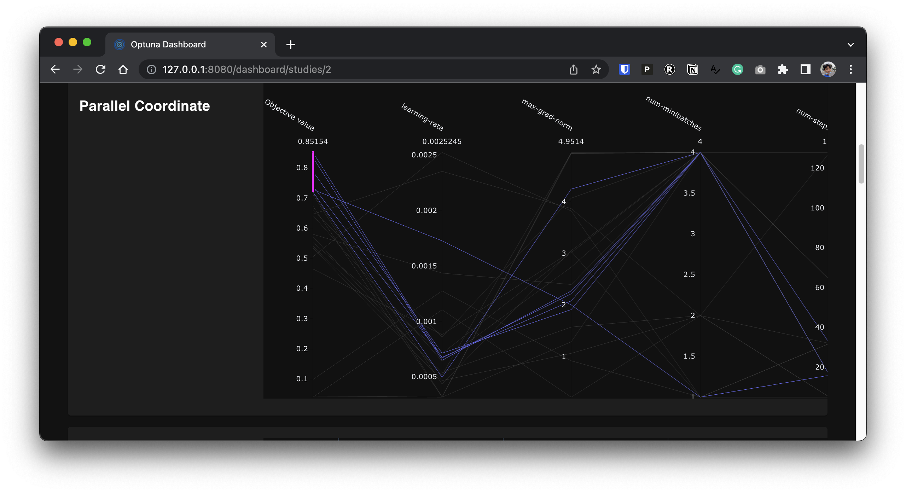

# Hyperparameter Tuning

CleanRL comes with a lightweight hyperparameter tuning utility `Tuner`, with a primary purpose of helping researchers find **a single set of  hyperparameters that works well with multiple tasks of similar type** (e.g., one set of parameters for MuJoCo, another set for Atari). We try to avoid tuning hyperparameters per task, which is usually adhoc and do not generalize.

## Get started

Consider the [:material-github: `tuner_example.py`](https://github.com/vwxyzjn/cleanrl/blob/master/tuner_example.py) in the CleanRL's root directory, which has the following content:


```python title="tuner_example.py"
import optuna

from cleanrl_utils.tuner import Tuner

tuner = Tuner(
    script="cleanrl/ppo.py",
    metric="charts/episodic_return",
    metric_last_n_average_window=50,
    direction="maximize",
    aggregation_type="average",
    target_scores={
        "CartPole-v1": [0, 500],
        "Acrobot-v1": [-500, 0],
    },
    params_fn=lambda trial: {
        "learning-rate": trial.suggest_loguniform("learning-rate", 0.0003, 0.003),
        "num-minibatches": trial.suggest_categorical("num-minibatches", [1, 2, 4]),
        "update-epochs": trial.suggest_categorical("update-epochs", [1, 2, 4, 8]),
        "num-steps": trial.suggest_categorical("num-steps", [5, 16, 32, 64, 128]),
        "vf-coef": trial.suggest_uniform("vf-coef", 0, 5),
        "max-grad-norm": trial.suggest_uniform("max-grad-norm", 0, 5),
        "total-timesteps": 100000,
        "num-envs": 16,
    },
    pruner=optuna.pruners.MedianPruner(n_startup_trials=5),
    sampler=optuna.samplers.TPESampler(),
)
tuner.tune(
    num_trials=100,
    num_seeds=3,
)
```

You can run the tuner with the following command:

```bash
poetry install -E optuna
python tuner_example.py
```

<script id="asciicast-517226" src="https://asciinema.org/a/517226.js" async></script>


Often it is useful to find a single set of hyper parameters that work well with multiple environments, but this is challenging **because each environment may have different reward scales**, so we need to normalize the reward scales. 

This is where `target_scores` comes in. We can use it to specify an upper and lower threshold of rewards for each environment (they don't have to be exact boundaries and can be just ballpark estimates). For example, if we want to find a set of hyper parameters that work well with `CartPole-v1` and `Acrobot-v1`, we can set the `target_scores` and `aggregation_type` as follows:

```python
tuner = Tuner(
    ...,
    target_scores={
        "CartPole-v1": [0, 500],
        "Acrobot-v1": [-500, 0],
    }
    aggregation_type="average",
)
```


Here is what happened when running `python tuner_example.py`:

1. The `tuner_example.py` launches `num_trials=100` *trials* to find the best single set of hyperparameters for `CartPole-v1` and `Acrobot-v1` in `script="cleanrl/ppo.py"`.
1. Each *trial* samples a set of hyperparameters from the `params_fn` to run `num_seeds=3` *experiments* with different random seeds, mitigating the impact of randomness on the results. 
    * In each *experiment*, `tuner_example.py` averages the last `metric_last_n_average_window=50` reported `metric="charts/episodic_return"` to a number $x_i$ and calculate a normalized score $z_i$ according to the `target_scores`. In this case, $z_{i_0} = (x_{i_0} - 0) / (500 - 0)$ and $z_{i_1} = (x_{i_1} - -500) / (0 - -500)$. Then the tuner will `aggregation_type="average"` the two scores to get the normalized score $z_i = (z_{i_0} + z_{i_1}) / 2$.
1. Each *trial* then averages the normalized scores $z_i$ of the `num_seeds=3` *experiments* to a number $z$ and the tuner optimizes $z$ according `direction="maximize"`.


Note that we are using 3 random seeds for each environment in `["CartPole-v1","Acrobot-v1"]`, totalling `2*3=6` experiments per trial.


???+ info

    When optimizing Atari games, you can put the human normalized scores in `target_scores` (Mnih et al., 2015, Extended Data Table 2)[^1], as done in the following example. The first number for each environment is the score obtained by random play and the second number is the score obtained by professional game testers. Note here we using `aggregation_type="median"`, this means we will optimize for the **median** of the human normalized scores **averaged** over the `num_seeds=3` experiments for each trial (pay close attention to the phrasing).

    ```python
    tuner = Tuner(
        script="cleanrl/ppo_atari_envpool.py",
        metric="charts/episodic_return",
        metric_last_n_average_window=50,
        direction="maximize",
        aggregation_type="median",
        target_scores={
            "Alien-v5": [227.8, 6875],
            "Amidar-v5": [5.8, 1676],
            'Assault-v5': (222.4, 1496),
            'Asterix-v5': (210.0, 8503),
            'Asteroids-v5': (719.1, 13157),
            ...
        },
        num_seeds=3,
        ...
    )
    ```

## Visualization

Running `python tuner_example.py` will create a sqlite database containing all of the hyperparameter trials in `./cleanrl_hpopt.db`  We can use [optuna-dashboard](https://github.com/optuna/optuna-dashboard) to visualize the process.

```bash
poetry run optuna-dashboard sqlite:///cleanrl_hpopt.db
```



In the panel above, the y-axis shows the normalized score of the two environments (`CartPole-v1` and `Acrobot-v1`) and the x-axis shows the number of trials.



The panel above shows the parallel coordinates plot of the normalized score — for example, we can see having a lower learning rate and a higher number of minibatches is a good choice.


???+ info

    You can use a different database by passing `Tuner(..., storage="mysql://root@localhost/example")` to use a more persistent storage.

## Work w/o knowing the reward scales

What if we don't know the reward scales for the environments? We can optionally set the value `target_scores` to `None`, but this will only work with one environment at a time because it's difficult to optimize without knowing the scale of the rewards in each environment.


```python title="tuner_example.py" hl_lines="11-13"
import optuna

from cleanrl_utils.tuner import Tuner

tuner = Tuner(
    script="cleanrl/ppo.py",
    metric="charts/episodic_return",
    metric_last_n_average_window=50,
    direction="maximize",
    aggregation_type="average",
    target_scores={
        "CartPole-v1": None,
    },
    params_fn=lambda trial: {
        "learning-rate": trial.suggest_loguniform("learning-rate", 0.0003, 0.003),
        "num-minibatches": trial.suggest_categorical("num-minibatches", [1, 2, 4]),
        "update-epochs": trial.suggest_categorical("update-epochs", [1, 2, 4, 8]),
        "num-steps": trial.suggest_categorical("num-steps", [5, 16, 32, 64, 128]),
        "vf-coef": trial.suggest_uniform("vf-coef", 0, 5),
        "max-grad-norm": trial.suggest_uniform("max-grad-norm", 0, 5),
        "total-timesteps": 100000,
        "num-envs": 16,
    },
    pruner=optuna.pruners.MedianPruner(n_startup_trials=5),
    sampler=optuna.samplers.TPESampler(),
)
tuner.tune(
    num_trials=100,
    num_seeds=3,
)
```

In the example above, we will set the normalized score $z_i$ to be the average of the last `metric_last_n_average_window=50` reported `metric="charts/episodic_return"` for `CartPole-v1`.


## Work w/ pruners and samplers

You can use `Tuner` with any [pruner](https://optuna.readthedocs.io/en/stable/reference/pruners.html) from `optuna` to prune less promising experiments or [samplers](https://optuna.readthedocs.io/en/stable/reference/samplers.html) to sample new hyperparameters. If you don't specify them explicitly, the script will use the [default ones](https://optuna.readthedocs.io/en/stable/reference/generated/optuna.create_study.html).

```python title="tuner_example.py" hl_lines="1 24 25"
import optuna

from cleanrl_utils.tuner import Tuner

tuner = Tuner(
    script="cleanrl/ppo.py",
    metric="charts/episodic_return",
    metric_last_n_average_window=50,
    direction="maximize",
    aggregation_type="average",
    target_scores={
        "CartPole-v1": None,
    },
    params_fn=lambda trial: {
        "learning-rate": trial.suggest_loguniform("learning-rate", 0.0003, 0.003),
        "num-minibatches": trial.suggest_categorical("num-minibatches", [1, 2, 4]),
        "update-epochs": trial.suggest_categorical("update-epochs", [1, 2, 4, 8]),
        "num-steps": trial.suggest_categorical("num-steps", [5, 16, 32, 64, 128]),
        "vf-coef": trial.suggest_uniform("vf-coef", 0, 5),
        "max-grad-norm": trial.suggest_uniform("max-grad-norm", 0, 5),
        "total-timesteps": 100000,
        "num-envs": 16,
    },
    pruner=optuna.pruners.MedianPruner(n_startup_trials=5),
    sampler=optuna.samplers.TPESampler(),
)
tuner.tune(
    num_trials=100,
    num_seeds=3,
)
```


## Track experiments w/ Weights and Biases

The `Tuner` can track all the experiments into [Weights and Biases](https://wandb.ai) to help you visualize the progress of the tuning.


```python title="tuner_example.py" hl_lines="26"
import optuna

from cleanrl_utils.tuner import Tuner

tuner = Tuner(
    script="cleanrl/ppo.py",
    metric="charts/episodic_return",
    metric_last_n_average_window=50,
    direction="maximize",
    aggregation_type="average",
    target_scores={
        "CartPole-v1": None,
    },
    params_fn=lambda trial: {
        "learning-rate": trial.suggest_loguniform("learning-rate", 0.0003, 0.003),
        "num-minibatches": trial.suggest_categorical("num-minibatches", [1, 2, 4]),
        "update-epochs": trial.suggest_categorical("update-epochs", [1, 2, 4, 8]),
        "num-steps": trial.suggest_categorical("num-steps", [5, 16, 32, 64, 128]),
        "vf-coef": trial.suggest_uniform("vf-coef", 0, 5),
        "max-grad-norm": trial.suggest_uniform("max-grad-norm", 0, 5),
        "total-timesteps": 100000,
        "num-envs": 16,
    },
    pruner=optuna.pruners.MedianPruner(n_startup_trials=5),
    sampler=optuna.samplers.TPESampler(),
    wandb_kwargs={"project": "cleanrl"},
)
tuner.tune(
    num_trials=100,
    num_seeds=3,
)
```


<!-- 
```
$ wandb sweep -p cleanrl cleanrl_utils/tuner_config/ppo_continuous_action_envpool_jax.yaml

wandb: Creating sweep from: cleanrl_utils/tuner_config/ppo_continuous_action_envpool_jax.yaml
wandb: Created sweep with ID: pvux95ci
wandb: View sweep at: https://wandb.ai/costa-huang/cleanRL/sweeps/pvux95ci
wandb: Run sweep agent with: wandb agent costa-huang/cleanrl/pvux95ci
```

Then run `wandb agent costa-huang/cleanrl/pvux95ci`

## Optuna

```
optuna create-study --study-name "distributed-example" --storage "sqlite:///cleanrl_hpopt.db"
optuna-dashboard sqlite:///cleanrl_hpopt.db
``` -->


[^1]:Mnih, V., Kavukcuoglu, K., Silver, D. et al. Human-level control through deep reinforcement learning. Nature 518, 529–533 (2015). https://doi.org/10.1038/nature14236